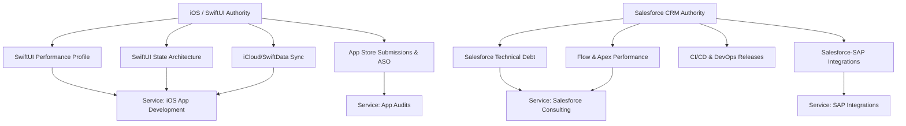

# Content Strategy & Topical Clusters Plan: RomeroDev

This content strategy aims to establish RomeroDev as a high-authority resource in two distinct clusters: **iOS & SwiftUI Product Engineering** and **Advanced Salesforce Consulting & Integrations**.

---

## 1. Topical Clusters Structure

---

## 2. Topic Editorial Outline

### 2.1 Cluster A: iOS & SwiftUI Product Engineering
* **Objective:** Capture high-intent queries from tech startups, CTOs, and independent developers looking to build modern Apple products.
* **Core Topics & Keyword Targets:**
  1. *Rendimiento y fluidez en SwiftUI (SwiftUI Performance Profiling)*
     * **Intent:** Informational (Advanced)
     * **Keywords:** swiftui performance, slow lists swiftui, main thread hangs xcode
     * **Structure:** Xcode Instruments walkthrough, slow frames metrics, cell reusable fixes.
  2. *Arquitectura SwiftUI y SwiftData (SwiftUI & SwiftData Architecture)*
     * **Intent:** Informational
     * **Keywords:** swiftui state management, adopt swiftdata, observable model macro
     * **Structure:** Unidirectional data flows, ModelContext concurrency.
  3. *ASO para apps independientes (App Store ASO Optimization)*
     * **Intent:** Informational / Commercial
     * **Keywords:** app store optimization independent apps, ios metadata sync, aso keywords
     * **Structure:** Keywords localization, App Store Connect metadata automation.

### 2.2 Cluster B: Advanced Salesforce CRM & Integrations
* **Objective:** Attract IT managers, directors of operations, and Salesforce administrators at enterprise companies seeking consulting or technical debt relief.
* **Core Topics & Keyword Targets:**
  1. *Estrategias de integración Salesforce-SAP (Salesforce-SAP Integration)*
     * **Intent:** Informational (Enterprise)
     * **Keywords:** salesforce sap integration architecture, apex callouts erp, mulesoft sap connector
     * **Structure:** Event-driven sync, error boundary handling, OAuth security schemes.
  2. *Reducción de deuda técnica en Salesforce (Salesforce Technical Debt Reduction)*
     * **Intent:** Informational / Commercial
     * **Keywords:** salesforce technical debt, trigger framework refactoring, clean unused custom fields
     * **Structure:** Trigger consolidation patterns, PMD rulesets, optimizer reports.
  3. *CI/CD y Release Management (Salesforce DevOps)*
     * **Intent:** Informational
     * **Keywords:** salesforce sfdx pipeline, copado alternative, git pull request sandboxes
     * **Structure:** SFDX CLI deployments, automated unit tests runs.

---

## 3. Article Standards & SEO Rules

To ensure articles act as organic landing channels, each piece must follow these guidelines:
1. **Practical Experience Focus:** No superficial or generic lists. Code blocks (Swift, Apex) or architecture diagrams must accompany every article.
2. **Dynamic Reading Interface:**
   - Table of contents.
   - H2 and H3 tags indicating precise keywords.
   - Author info and reading time.
3. **Structured Data:** Every article page automatically outputs a `BlogPosting` JSON-LD configuration with author details, publish date, and publisher attributes.
4. **Internal Link Placements:**
   - Every article must contain at least **two internal links** pointing to:
     * A related service page (e.g. `/es/desarrollo-ios/`).
     * A related case study page (e.g. `/en/case-studies/vitalspath/`).
